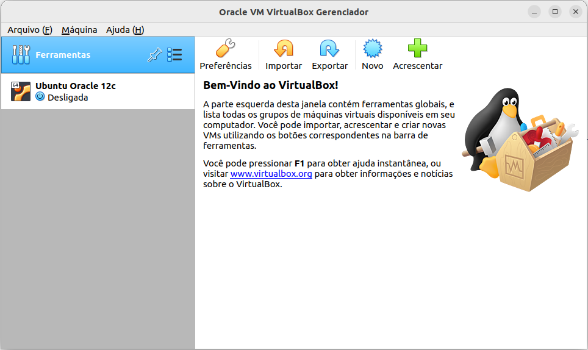
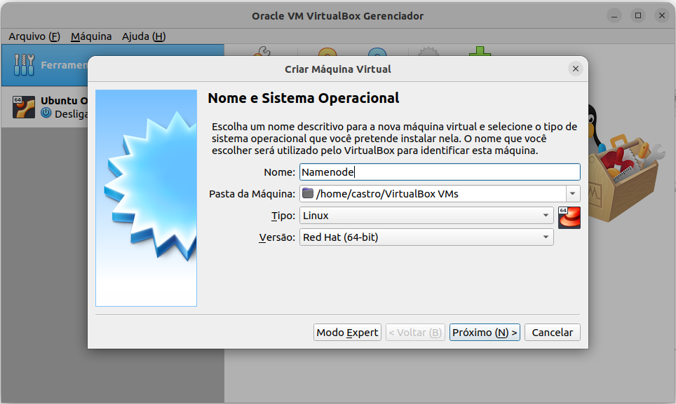

Link para o projeto no 
[Notion](https://castroiwnl.notion.site/castroiwnl/Data-Lake-On-Premises-9845115c23374331a7a65c658fe3eeb1)

Link para o projeto no
[Site](https://alexandre-castro.vercel.app/blog/datalake-premises)


- Preparando as máquinas

Antes de qualquer passo, para este projeto, estarei utilizando o Virtualbox da Oracle para a virtualização das máquinas, mas não é obrigatório a utilização deste, podendo ser qualquer outro virtualizador, desde de que seja possível a configuração de rede das máquinas.


Iniciar o Virtualbox e selecionar a opção:

- Novo



Segue o modelo de criação das diferentes máquinas:

- **Criação do Namenode**

<aside>
💡 É obrigatório a criação do Namenode, por mais que um dia não vá utilizar nenhum Datanode.

</aside>

Escolha um nome para a sua máquina que será o Namenode, seguindo essas configurações de tipo e versão, pois estaremos utilizando o CentOS como sistema operacional.

Selecione a opção:

- Próximo (N) >



Em seguida selecione a quantidade de memória que será alocada a máquina, para o Namenode é importante que seja um pouco mais forte do que os Datanodes, já que ele que será o orquestrador do Hadoop, neste caso estarei alocando **4GB** de memória RAM.

Selecione a opção:

- Próximo (N) >


Criação do disco rígido virtual para armazenamento dos dados da máquina.

Selecione a opção:

- Criar um novo disco rígido virtual agora
- Próximo (N) >


Selecione a opção:

- VDI (VirtualBOX Disk Image)
- Próximo (N) >


Selecione a opção:

- Dinamicamente alocado

<aside>
💡 Importante que o disco seja dinamicamente alocado para não ocupar todo o espaço reservado em sua máquina física.

</aside>

- Próximo (N) >


Selecione a quantidade que será alocada dinamicamente no disco virtual, recomendo no mínimo **10GB**, estarei colocando **20GB** para ter uma margem a mais mantendo o diretório padrão de onde será armazenado o disco virtual.

Selecione a opção:

- Criar


Após isso, foi criado o Namenode, agora temos que alterar as configurações de rede, para as máquinas poderem se comunicarem entre si.

Selecione a opção:

- Configurações


Abrirá a tela de configurações, vá na aba Rede.

Clique em:

- Conectado e selecione a opção ‘Placa em modo Bridge’
- Clique em OK


Seguindo esses passos, o Namenode agora está habilitado a ter seu IP próprio para realizar a configuração de conexão entre os clusters.

- **Criação do Datanode**

Para sua criação, seguiremos praticamente os mesmos passos da criação do Namenode, com apenas duas alterações.

A primeira alteração será no nome da máquina, neste caso será o Datanode1

<aside>
💡 Estarei utilizando 2 Datanodes para a formação do meu datalake, mas não é obrigatório possuir Datanodes, ou apenas 2 Datanodes, pode ser criado infinitos Datanodes, desde que você tenha capacidade computacional para isso.

</aside>


A segunda alteração será na quantidade de memória, alocarei apenas **2GB**, porque como citei na criação do Namenode, os Datanodes podem ter menos poder computacional.


---

- Instalação do CentOS

Para a instalação do sistema operacional, é necessário baixar a ISO dele, neste caso estarei utilizando a versão Minimal do CentOS, para baixo consumo de recursos e ganho de performance nos clusters.


Acesse a página de Download do CentOS

[https://www.centos.org/download/](https://www.centos.org/download/)

Estarei utilizando a versão x86_64

Selecione a opção:

- x86_64

<aside>
💡 Também é possível escolher outras versões caso a x86_64 não seja compatível com seu virtualizador ou máquina.

</aside>


Selecione um dos mirrors de Download, estarei selecionando o [primeiro](http://mirror.uepg.br/centos/7.9.2009/isos/x86_64/)


Selecione a opção:

- CentOS-7-x86_64-Minimal-2009.iso


Após realizar o Download é hora de instalar o CentOS nas máquinas que foram criadas.

- **Instalação do CentOS no Namenode**

Abra o Virtual Box, clique no Namenode.

<aside>
💡 Máquina criada na etapa anterior.

</aside>

Selecione a opção:

- Iniciar (T)


Abra essa janela, clique no símbolo da pasta ao lado do campo de seleção.


Selecione o diretório da ISO do CentOS (CentOS-7-x86_64-Minimal-2009.iso).

Clique em:

- Acrescentar


Após selecionar a ISO clique em:

- Iniciar


Após iniciar, selecione a opção:

- Install CentOS 7


Após as telas de logs, aparecerá o instalador do CentOS.

Nesta tela você configura as linguagens do SO, no meu caso deixarei no padrão (English).

Selecione a opção:

- Continue


Agora vou configurar as opções de região, data e hora.

Selecione a opção:

- DATE & TIME


Marque a região mais próxima de onde você se localiza

Selecione a opção:

- Done


Indicando o destino de onde será instalado o SO.

Desça a tela e selecione a opção:

- INSTALLATION DESTINATION


Marque o disco virtual criado na etapa anterior.

Selecione a opção:

- Done


Configuração de rede e nome do Host

Selecione a opção:

- NETWORK & HOST NAME


Marque a caixinha como ON embaixo do ‘botão Help!’, para habilitar a internet na máquina

Altere o Host name para o nome da sua máquina criada na etapa anterior e clique em:

- Apply
- Done


Começar a instalação do SO.

Clique em:

- Begin Installation


Configuração da senha do usuário Root

Clique em:

- ROOT PASSWORD


Definindo uma senha para o Root

Insira uma senha segura e clique em:

- Done


Criação de um usuário

Clique em:

- USER CREATION


Preencha o nome do usuário e crie uma senha segura para ele, depois clique em:

- Done


Após toda a configuração, espere a barra de instalação completar e aperte o botão:

- Reboot


- **Instalação do CentOS no Datanode**

A instalação no Datanode é praticamente igual ao do Namenode, porém é necessário alterar o Host name para o nome da sua máquina Datanode, repita esse processo para todos os Datanodes.


---

- Configuração inicial do Linux

Para começar a configurar as máquinas, estarei me conectando através do SSH da minha máquina local nas máquinas virtuais no terminal.

Como a minha máquina principal também é Linux, eu consigo diretamente pelo terminal utilizar o comando SSH para me conectar nas máquinas, para isso, antes é necessário ligar o Namenode e os Datanodes, no meu caso 2 Datanodes.

<aside>
💡 Para usuários de Windows:
Se você tentar se conectar pelo PowerShell do Windows, você não conseguirá, para solucionar isso baixe o Putty e faça a conexão diretamente dele.

</aside>

Abra o Virtual Box

Selecione o Namenode e os Datanodes e clique em:

- Iniciar (T)


Abrirá neste menu.

Selecione a primeira opção apertando o ‘Enter’ do teclado.


Após iniciar e aguardar os logs de inicialização, faça o login criado na instalação, realizado na  etapa anterior.


Repita esse processo para todos os Datanodes.

Datanode1:


Datanode2: 


Após ligar e logar em todas máquinas, precisamos do IP de cada uma delas para realizar a conexão via SSH. Entre em cada máquina e colete o IP delas através do comando:

```bash
ip a 
```


IP das minhas máquinas:

```bash
Namenode: 192.168.1.16
Datanode1: 192.168.1.14
Datanode2: 192.168.1.15
```

<aside>
💡 Vale ressaltar que esses IP’s não serão necessariamente iguais aos meus (mesmo podendo ser também), por isso é importante anotar eles.

</aside>

Após as coletas, abra o Terminal da sua máquina local e insira o comando:

```bash
ssh usuário@ipdamaquina 
```

Depois aparecerá este aviso:

`Are you sure you want to continue connecting (yes/no/[fingerprint])?`

Digite `yes`. Depois será solicitado a senha do usuário, digite ela e estará conectado.

<aside>
💡 Usuário criado na instalação do CentOS

</aside>

Conectando com a minha máquina no Namenode:

<aside>
💡 Para usuários de Windows: 
É hora de usar o Putty e fazer a conexão via SSH.

</aside>

```bash
ssh datalake@192.168.1.16
```


Neste momento já estou conectado ao meu Namenode pelo SSH na minha máquina local.

Repita esse processo novamente para todos os Datanodes abrindo mais janelas no terminal.

Conexão com o Datanode1:

```bash
ssh datalake@192.168.1.14
```


Conexão com o Datanode2:

```bash
ssh datalake@192.168.1.15
```


Agora, estamos oficialmente 100% prontos para as configurações do Linux.

- **Configuração do Sudoers**

<aside>
💡 É necessário realizar esse passo para todas as máquinas.

</aside>

Para poder realizar os comandos de Root no usuário datalake, é necessário configurar o arquivo sudoers. 

Primeiro passo, entre no root:

```bash
su - 
```

Edite o arquivo sudoers:

```bash
vi /etc/sudoers
```

Insira dentro do arquivo o nome do usuário datalake.

```bash
datalake    ALL=(ALL)    ALL
```


Salve o arquivo e saia do perfil Root, executando o comando:

```bash
exit
```

- **Atualizando o sistema**

<aside>
💡 É necessário realizar esse passo para todas as máquinas.

</aside>

Após a configuração do arquivo `sudoers` e acesso do Linux com o usuário datalake vou verificar se possui atualizações e se sim, realizar elas.

```bash
sudo yum update
```

Quando terminar a atualização ele mostrará uma mensagem de concluído na tela.


- **Configurando o arquivo hosts**

Para as máquinas poderem se comunicar entre si, temos que configurar as chaves de segurança SSH, para esta tarefa precisamos primeiro configurar o arquivo hosts das nossas máquinas.

Para modificar o arquivo hosts, use o comando:

```bash
sudo vi /etc/hosts 
```

Informe para o arquivo hosts qual são os IP’s das máquinas que ele fará conexão e ao seu lado coloque o nome indicativo de qual máquina está apontando o IP.

```bash
192.168.1.14   datanode1
192.168.1.15   datanode2
```


Repita esse processo para todas as máquinas modificando os IP’s e nomes das máquinas.


Depois de configurado, devemos testar para ver se as máquinas estão se comunicando entre-si, só rodar o comando em qualquer máquina:

```bash
ping datanode1 
ping datanode2
```


Caso o ping esteja retornando os milissegundos entre as conexões, significa que foi configurado corretamente.

- **Configurando o arquivo sshd_config**

Para habilitar a conexão via SSH entre máquinas é necessário configurar o arquivo sshd_config, nele estão as configurações de conexão do SSH.

<aside>
💡 É necessário realizar todos passos seguintes em todas as máquinas.
</aside>

Para editar este arquivo, rodamos o comando:

```bash
sudo vi /etc/ssh/sshd_config
```

Após abrir o editor no arquivo, é necessário remover o comentário dos comandos:

```bash
Port 22
ListenAddress 0.0.0.0
ListenAddress ::
PubkeyAuthentication yes
```


Por último reinicie o serviço do sshd para alterar as configurações feitas:

```bash
sudo systemctl restart sshd
```

Pronto! Arquivo `sshd` devidamente configurado. 

- **Configurando as chaves de segurança SSH**

Após a configuração do arquivo hosts e arquivo sshd, agora é hora de configurar o SSH.

A configuração da chave SSH fará com que as máquinas se comuniquem sem precisarem de senhas no momento em que algo for feito entre as máquinas.

<aside>
💡 É necessário realizar todos passos seguintes apenas no Namenode

</aside>

Para gerar a chave de SSH, precisamos estar em nosso Namenode e rodar o comando:

```bash
ssh-keygen
```

Caso queira fazer alguma modificação na chave, você tem essa opção, no meu caso vou deixar tudo como padrão, seguindo apertando ‘Enter’ para gerar a chave.

<aside>
💡 Vale ressaltar que essa chave foi criada no usuário datalake, cada chave é gerada em cada usuário. Caso tente ver essa chave em outro usuário da mesma máquina, não conseguirá.

</aside>


Para verificar a criação da chave utilize o comando:

```bash
cat ~/.ssh/nomedachave
```

No meu caso a chave criada se chama id_rsa (padrão)

comando: 

```bash
cat ~/.ssh/id_rsa
```


Chave gerada! É necessário copiar essa chave para o próprio usuário datalake

```bash
ssh-copy-id -i ~/.ssh/id_rsa datalake@namenode
```

Essa chave também precisa ser copiada para as outras máquinas fazendo com que elas se comuniquem.

```bash
ssh-copy-id -i ~/.ssh/chave usuario@datanode
```

Cópia da chave para os Datanodes.

```bash
ssh-copy-id -i ~/.ssh/id_rsa datalake@datanode1
ssh-copy-id -i ~/.ssh/id_rsa datalake@datanode2
```


Será solicitado a confirmação da conexão, só responder com `yes` e também será solicitado a senha do usuário.

<aside>
💡 Só foi possível utilizar o nome do host Datanode1 por conta da configuração do arquivos hosts, caso o arquivos hosts não estivesse configurado, o nome do host poderia ser substituído pelo IP do host.

</aside>

Repita esse comando para todos os Datanodes.

<aside>
💡 Cópia da chave para o Datanode2

</aside>


Para verificar o funcionamento da chave, vou conectar através do SSH nos Datanodes.

```bash
ssh datalake@datanode1 -i ~/.ssh/id_rsa
ssh datalake@datanode2 -i ~/.ssh/id_rsa
```


Conexão feita com sucesso, sem solicitar a senha, perceba que agora possui duas janelas de Datanode1. Verifique se os outros Datanodes também estão se conectando via SSH sem pedir senha.

Após isso podemos sair da conexão e voltar para o Namenode, utilizando o comando:

```bash
exit
```

Chave configurada, tudo oficialmente pronto para o início da instalação do Hadoop.


---

- Instalação e configuração do Java JDK 8

Maior parte das aplicações da Apache roda sobre o Java, para isso devemos instalar o Java JDK, estarei utilizando a versão 8 porque é compatível com maior parte dos componentes, por mais que a versão do Hadoop atual suporte o Java 11.
 

<aside>
💡 Certifique-se de que todas as máquinas estão ligadas.

</aside>

**Download do Java 8**

Para isso é necessário baixar o Java JDK 8 através do seguinte link:

[https://www.oracle.com/br/java/technologies/javase/javase8-archive-downloads.html](https://www.oracle.com/br/java/technologies/javase/javase8-archive-downloads.html)

Estarei selecionando a versão de Linux x64 compactada.

Baixe a opção na sua máquina local:

- jdk-8u202-linux-x64.tar.gz

<aside>
💡 Estarei selecionando essa opção, mas não é obrigatório, baixe a compatível com a sua máquina.

</aside>


Será solicitado o login, caso não tenha, faça um cadastro no site da Oracle.

[https://profile.oracle.com/myprofile/account/create-account.jspx](https://profile.oracle.com/myprofile/account/create-account.jspx)


Após o login o Download será iniciado automaticamente.

**Copiando o Java para as máquinas**

Depois de baixar, faremos a cópia desse arquivo.

Abra o terminal da sua máquina local, onde foi baixado o Java e execute o comando:

```bash
scp /caminho/jdk-8u202-linux-x64.tar.gz root@ipdonamenode:/opt
```


Faça a cópia do Java para os Datanodes também

```bash
scp /caminho/jdk-8u202-linux-x64.tar.gz root@ipdodatanode:/opt
```


Após a execução, verifique se a cópia realmente foi feita. Acesse o diretório `/opt/` das máquinas e execute o comando `ls -la` para verificar se o arquivo foi realmente copiado


Após verificar estamos preparados para instalar o Java.

<aside>
💡 É necessário realizar todos passos seguintes em todas as máquinas.

</aside>

**Instalação do Java 8**

Para a instalação, o primeiro passo é extrair o conteúdo do arquivo jdk-8u202-linux-x64.tar.gz,

para isso utilizaremos o comando, responsável por extrair os arquivos:

```bash
sudo tar xzf jdk-8u202-linux-x64.tar.gz
```

Verificando se foi extraído corretamente:

```bash
ls -la
```


Agora irei apagar o arquivo compactado, renomear o diretório criado para JDK e alterar o dono e grupo, seguindo uma boa prática de padronização.

```bash
sudo rm -rf jdk-8u202-linux-x64.tar.gz
sudo mv jdk1.8.0_202/ /opt/jdk
ls -la
sudo chown -R root:root jdk/
```


Para dar continuidade a instalação, precisa configurar as variáveis de ambiente, para isso edite o arquivo `.bash_profile`, localizado no `~/`

Insira as seguintes configurações no arquivo, indicando o caminho do Java:

```bash
export JAVA_HOME=/opt/jdk
export JRE_HOME=/opt/jdk/jre
export PATH=$PATH:$JAVA_HOME/bin:$JRE_HOME/bin
```


Para atualizar o arquivo de variáveis de ambiente rode o comando 

```bash
source .bash_profile
```

Para verificar se tudo está configurado corretamente, rode o comando 

```bash
java -version
```


Caso apareça a versão, significa que tudo está corretamente configurado.

Agora é possível a instalação do Hadoop.


---

- Instalação e configuração do Apache Hadoop

<aside>
💡 Para a instalação do Hadoop, certifique que todas as máquinas estejam iniciadas e com o Java JDK instalado.

</aside>

Primeiro passo é fazer o Download do arquivo binário do Hadoop 3.3.4:

[https://hadoop.apache.org/releases.html](https://hadoop.apache.org/releases.html)


Copie o link de Download

[https://dlcdn.apache.org/hadoop/common/hadoop-3.3.4/hadoop-3.3.4.tar.gz](https://dlcdn.apache.org/hadoop/common/hadoop-3.3.4/hadoop-3.3.4.tar.gz)


Abra o terminal do Namenode, vá ao diretório `/opt/` e insira o comando `wget` com o link do Hadoop:

<aside>
💡 Só será possível a execução do comando wget, caso você tenha ele instalado.

</aside>

```bash
sudo wget https://dlcdn.apache.org/hadoop/common/hadoop-3.3.4/hadoop-3.3.4.tar.gz
```


Verificando, extraindo, removendo o arquivo compactado e alterando o nome do diretório.

```bash
ls -la
sudo tar xzf hadoop-3.3.4.tar.gz
sudo rm -rf hadoop-3.3.4.tar.gz
sudo mv hadoop-3.3.4/ /opt/hadoop
```


Adotando novamente outro padrão, estarei colocando no usuário datalake todas as instalações dos componentes Apache.

```bash
sudo chown -R datalake:datalake hadoop/
```


Agora irei configurar as variáveis de ambiente do meu usuário datalake inserindo as seguintes configurações:

```bash
export HADOOP_HOME=/opt/hadoop
export HADOOP_CONF_DIR="${HADOOP_HOME}/etc/hadoop"
export PATH=$PATH:$HADOOP_HOME/bin
```


Agora podemos testar a versão do Hadoop, caso as variáveis de ambiente tenham sido corretamente configuradas.

```bash
hadoop version
```


- **Configuração do Hadoop**

Após a instalação e configuração das variáveis de ambiente, precisamos configurar o Hadoop, para isso é necessário entrar no diretório: `/opt/hadoop/etc/hadoop`

Começarei configurando o arquivo `hadoop-env.sh`, insira ou habilite as seguintes linhas no arquivo:

```bash
export JAVA_HOME=/opt/jdk
export HADOOP_HOME=/opt/hadoop
export HADOOP_CONF_DIR="${HADOOP_HOME}/etc/hadoop"
export PATH="${PATH}:${HADOOP_HOME}/bin"
export HADOOP_SSH_OPTS="-i ~/.ssh/id_rsa"
```


Configurando o arquivo `core-site.xml`

Apague as tags `configuration`.

<aside>
💡 Muito cuidado apagando este tipo de arquivo para não apagar as indentações.

</aside>


Insira as seguintes configurações:

```html
<configuration>
    <property>
        <name>fs.default.name</name>
        <value>hdfs://namenode:19000</value>
    </property>
</configuration>
```


Configurando o `hdfs-site.xml`

Insira as seguintes configurações:

```html
<configuration>
    <property>
        <name>dfs.replication</name>
        <value>3</value>
    </property>
    <property>
        <name>dfs.namenode.name.dir</name>
        <value>/opt/hadoop/dfs/namespace_logs</value>
    </property>
    <property>
        <name>dfs.datanode.data.dir</name>
        <value>/opt/hadoop/dfs/data</value>
    </property>
</configuration>
```


Configurando o `mapred-site.xml`

Insira as seguintes configurações:

```html
<configuration>
    <property>
        <name>mapreduce.job.user.name</name>
        <value>hadoop</value>
    </property>
    <property>
        <name>yarn.resourcemanager.address</name>
        <value>namenode:8032</value>
    </property>
    <property>
        <name>mapreduce.framework.name</name>
        <value>yarn</value>
    </property>
    <property>
        <name>yarn.app.mapreduce.am.env</name>
        <value>HADOOP_MAPRED_HOME=/opt/hadoop</value>
    </property>
    <property>
        <name>mapreduce.map.env</name>
        <value>HADOOP_MAPRED_HOME=/opt/hadoop</value>
    </property>
    <property>
        <name>mapreduce.reduce.env</name>
        <value>HADOOP_MAPRED_HOME=/opt/hadoop</value>
    </property>
</configuration>
```


Configurando o `yarn-site.xml`

Insira as seguintes configurações:

```html
<configuration>
    <property>
        <name>yarn.resourcemanager.hostname</name>
        <value>namenode</value>
    </property>
    <property>
        <name>yarn.nodemanager.resource.memory-mb</name>
        <value>1536</value>
    </property>
    <property>
        <name>yarn.scheduler.maximum-allocation-mb</name>
        <value>1536</value>
    </property>
    <property>
        <name>yarn.scheduler.minimum-allocation-mb</name>
        <value>128</value>
    </property>
    <property>
        <name>yarn.nodemanager.vmem-check-enabled</name>
        <value>false</value>
    </property>
    <property>
        <name>yarn.server.resourcemanager.application.expiry.interval</name>
        <value>60000</value>
    </property>
    <property>
        <name>yarn.nodemanager.aux-services</name>
        <value>mapreduce_shuffle</value>
    </property>
    <property>
        <name>yarn.nodemanager.aux-services.mapreduce.shuffle.class</name>
        <value>org.apache.hadoop.mapred.ShuffleHandler</value>
    </property>
    <property>
        <name>yarn.log-aggregation-enable</name>
        <value>true</value>
    </property>
    <property>
        <name>yarn.log-aggregation.retain-seconds</name>
        <value>-1</value>
    </property>
    <property>
        <name>yarn.application.classpath</name>
        <value>$HADOOP_CONF_DIR,${HADOOP_COMMON_HOME}/share/hadoop/common/*,${HADOOP_COMMON_HOME}/share/hadoop/common/lib/*,${HADOOP_HDFS_HOME}/share/hadoop/hdfs/*,${HADOOP_HDFS_HOME}/share/hadoop/hdfs/lib/*,${HADOOP_MAPRED_HOME}/share/hadoop/mapreduce/*,${HADOOP_MAPRED_HOME}/share/hadoop/mapreduce/lib/*,${HADOOP_YARN_HOME}/share/hadoop/yarn/*,${HADOOP_YARN_HOME}/share/hadoop/yarn/lib/*</value>`

    </property>
</configuration>
```


Por último a configuração do arquivo `workers`, nele serão inseridos os Datanodes que farão comunicação com o Namenode. Insira o nome dos Datanodes.

<aside>
💡 Esses nomes são das máquinas configuradas no arquivo `hosts`.

</aside>


Configuração finalizada, mas antes de rodar o Hadoop, precisamos criar os diretórios onde serão salvo os logs e registros do HDFS, para isso executei os comandos:

```bash
mkdir /opt/hadoop/dfs
mkdir /opt/hadoop/dfs/data
mkdir /opt/hadoop/dfs/namespace_logs
```

Após a instalação do Hadoop,  também é necessário realizar esse processo nos Datanodes, para não precisar repetir todo processo novamente.

Farei a cópia do diretório do Hadoop no Namenode, para os Datanodes.

Para fazer a copiar do Hadoop para os Datanodes, é essencial que seja criado a pasta dele antes de receber a cópia do diretório.

<aside>
💡 Faça isso para todos os Datanodes.

</aside>

```bash
sudo mkdir /opt/hadoop 
```


Caso esteja usando o padrão que estou seguindo, é importante alterar o dono e o grupo do diretório para datalake, igualmente feito no Namenode.

```bash
sudo chown -R datalake:datalake hadoop/
```


Agora posso fazer a cópia do diretório Hadoop configurado no Namenode para os Datanodes, utilizando a chave de segurança SSH.

```bash
scp -rv -i "~/.ssh/id_rsa" /opt/hadoop datalake@datanode1:/opt
scp -rv -i "~/.ssh/id_rsa" /opt/hadoop datalake@datanode2:/opt
```

Ao terminar a cópia aparecerá essa tela:


Acesse a pasta `/opt/hadoop` nos Datanodes e execute o comando `ls` para verificar se os arquivos chegaram corretamente.


Fim da instalação do Hadoop, agora, utilizando o Namenode formatei o HDFS

```bash
hadoop namenode -format
```


- **Inicialização do Hadoop**

Após a formatação do HDFS, iniciarei todos os serviços do Hadoop.

```bash
$HADOOP_HOME/sbin/start-all.sh
```


Verificando através do terminal se os serviços foram iniciados corretamente nas máquinas.

```bash
jps
```


Importando um arquivo teste e listando ele no HDFS

```bash
hdfs dfs -put alexandre.txt /
hdfs dfs -ls /
```


Acessando a interface web do Hadoop utilizando meu IP do Namenode com a porta `9870`

```bash
http://192.168.1.16:9870/
```


Verificando o funcionamento dos Datanodes

```bash
http://192.168.1.16:9870/dfshealth.html#tab-datanode
```


Verificando visualmente os arquivos dentro do HDFS

```bash
http://192.168.1.16:9870/explorer.html#/
```


Verificação do funcionamento do Yarn

```bash
http://192.168.1.16:8088/cluster
```


Tudo funcionando corretamente, irei desligar o Hadoop

```bash
$HADOOP_HOME/sbin/stop-all.sh
```


---

- Instalação e configuração do Apache Kafka

<aside>
💡 Para a instalação do Kafka, certifique que todas as máquinas estejam iniciadas e com o Java JDK instalado.

</aside>

Primeiro passo é fazer o Download do arquivo binário do Kafka:

[https://kafka.apache.org/downloads](https://kafka.apache.org/downloads)


Copie o link de download do binário:

[https://downloads.apache.org/kafka/3.3.1/kafka_2.13-3.3.1.tgz](https://downloads.apache.org/kafka/3.3.1/kafka_2.13-3.3.1.tgz)

Conectado ao Namenode, no diretório `/opt/`, faça o Download do binário

```bash
sudo wget https://downloads.apache.org/kafka/3.3.1/kafka_2.13-3.3.1.tgz
```


Após finalizar o Download, é necessário descompactá-lo, remover o arquivo compactado, alterar o nome e dono do arquivo.

```bash
sudo tar xzf kafka_2.13-3.3.1.tgz
sudo rm -rf kafka_2.13-3.3.1.tgz
sudo mv kafka_2.13-3.3.1/ /opt/kafka
```


Adotando novamente outro padrão, estarei colocando no usuário datalake todas as instalações dos componentes Apache.

```bash
sudo chown -R datalake:datalake kafka/
```


Configurando as variáveis de ambiente no arquivo `~/.bash_profile`

```bash
export KAFKA_HOME=/opt/kafka 
export PATH=$PATH:$KAFKA_HOME/bin
```


No diretório `/opt/kafka/config` faça a cópia do arquivo `server.properties`

```bash
cp server.properties server1.properties
cp server.properties server2.properties
```

Agora configure os arquivos copiados.

No arquivo `server1.properties`, habilite e altere as opções:

```bash
broker.id=1
listeners=PLAINTEXT://:9093
log.dirs=/tmp/kafka-logs-1
```

No arquivo `server2.properties`, habilite e altere as opções:

```bash
broker.id=2
listeners=PLAINTEXT://:9094
log.dirs=/tmp/kafka-logs-2
```

Agora posso iniciar e testar o funcionamento do Kafka.

O primeiro passo para testar é iniciar o Zookeeper pelo diretório `/opt/kafka`

```bash
bin/zookeeper-server-start.sh config/zookeeper.properties
```


Zookeeper inicializado com sucesso!

Abra 3 sessões de terminal e em cada terminal execute as configurações feitas dos brokers.

```bash
bin/kafka-server-start.sh config/server.properties
bin/kafka-server-start.sh config/server1.properties
bin/kafka-server-start.sh config/server2.properties
```

Verifique se a porta inicializada foi a inicializada de acordo com a configuração feita.

Inicialização com o arquivo `server.properties`


Inicialização com o arquivo `server1.properties`


Inicialização com o arquivo `server2.properties`


Abra uma nova sessão no terminal e crie um tópico Kafka.

```bash
bin/kafka-topics.sh --create --topic BrokersTres --bootstrap-server localhost:9092 --replication-factor 3 --partitions 1
```


Rode o comando abaixo para descrever o status do tópico criado.

```bash
bin/kafka-topics.sh --describe --topic BrokersTres --bootstrap-server localhost:9092
```


Inicialize o producer apontando o tópico criado.

```bash
bin/kafka-console-producer.sh --topic BrokersTres --bootstrap-server localhost:9092
```


Producer inicializado.

Abra uma nova sessão no terminal e inicialize o consumer apontando o tópico criado, puxando mensagens desde o início.

```bash
bin/kafka-console-consumer.sh --topic BrokersTres --from-beginning --bootstrap-server localhost:9092
```

Escreva mensagens no producer.


Verifique se chegou corretamente no consumer.


Tudo funcionando! podemos encerrar todos os serviços.

```bash
bin/zookeeper-server-stop.sh config/zookeeper.properties
bin/kafka-server-stop.sh config/server.properties
bin/kafka-server-stop.sh config/server1.properties
bin/kafka-server-stop.sh config/server2.properties
```


---

- Instalação e configuração do Apache Nifi

<aside>
💡 Para a instalação do Nifi, certifique que as máquinas estejam com Java JDK instalado.

</aside>

A instalação do Nifi será na máquina local.

Primeiro passo é fazer o Download do arquivo binário do Nifi:


Copie o link de download do binário:

[https://dlcdn.apache.org/nifi/1.18.0/nifi-1.18.0-bin.zip](https://dlcdn.apache.org/nifi/1.18.0/nifi-1.18.0-bin.zip)

Conectado ao Namenode, no diretório `/opt/`, faça o Download do binário

```bash
sudo wget https://dlcdn.apache.org/nifi/1.18.0/nifi-1.18.0-bin.zip
```


Após finalizar o Download, é necessário descompactá-lo, remover o arquivo compactado, alterar o nome e dono do arquivo.

```bash
sudo unzip nifi-1.18.0-bin.zip
sudo rm -rf nifi-1.18.0-bin.zip
sudo mv nifi-1.18.0/ /opt/nifi
```

Configurando as variáveis de ambiente no arquivo `~/.bash_profile`

```bash
export NIFI_HOME=/opt/nifi 
export PATH=$PATH:$NIFI_HOME/bin
```

Iniciando o Apache Nifi

<aside>
💡 Só irá rodar se você tiver o Java instalado em sua máquina local.

</aside>

```bash
$NIFI_HOME/bin/nifi.sh start
```


Crie um usuário no Nifi

```bash
$NIFI_HOME/bin/nifi.sh set-single-user-credentials <usuario> <senha>
```

Acesse

```bash
https://localhost:8443/nifi/login
```

Utilize o login criado.


Desligue o Nifi

```bash
$NIFI_HOME/bin/nifi.sh stop
```

Instalação do Nifi concluída.


---

- Instalação e configuração do Apache Spark

<aside>
💡 Para a instalação do Spark, certifique que todas as máquinas estejam iniciadas e com o Java JDK instalado.

</aside>

Primeiro passo é fazer o Download do arquivo binário do Spark:

[https://spark.apache.org/downloads.html](https://spark.apache.org/downloads.html)


Copie o link de Download do binário:

[https://dlcdn.apache.org/spark/spark-3.3.1/spark-3.3.1-bin-hadoop3.tgz](https://dlcdn.apache.org/spark/spark-3.3.1/spark-3.3.1-bin-hadoop3.tgz)


Abra o terminal do Namenode, vá ao diretório `/opt/` e insira o comando `wget` com o link binário do Spark:

<aside>
💡 Só será possível a execução do comando `wget`, caso você tenha ele instalado.

</aside>

```bash
sudo wget https://dlcdn.apache.org/spark/spark-3.3.1/spark-3.3.1-bin-hadoop3.tgz
```


Verificando, extraindo, removendo o arquivo compactado e alterando o nome do diretório.

```bash
ls -la
sudo tar xzf spark-3.3.1-bin-hadoop3.tgz
sudo rm -rf spark-3.3.1-bin-hadoop3.tgz
sudo mv spark-3.3.1-bin-hadoop3/ /opt/spark
```


Adotando novamente outro padrão, estarei colocando no usuário datalake todas as instalações dos componentes Apache.

```bash
sudo chown -R datalake:datalake spark/
```


Agora irei configurar as variáveis de ambiente do meu usuário datalake inserindo as seguintes configurações:

```bash
export SPARK_HOME=/opt/spark
export PATH=$PATH:$SPARK_HOME/bin
```


Testando seu funcionamento.

```bash
spark-shell
```


Utilize o atalho `CTRL+C` para fechar o `spark-shell`

- **Configurando o Spark em Multinode Cluster**

Entre no diretório `/opt/spark/conf` e faça uma cópia renomeada sem .template dos arquivos `spark-env.sh.template` e `workers.template`

```bash
cp spark-env.sh.template spark-env.sh
cp workers.template workers
```

Edite o arquivo `workers` e insira o IP dos Datanodes:


Edite o arquivo `spark-env.sh` e insira

```bash
export SPARK_MASTER_HOST=namenode
export JAVA_HOME=/opt/jdk
```


Para iniciar o Spark é necessário primeiro instalar-lo também nas outras máquinas, estarei fazendo a cópia do Namenode para os Datanodes.

Primeiramente é necessário criar o diretório do Spark nos Datanodes e alterar o dono do diretório.

```bash
sudo mkdir /opt/spark
sudo chown -R datalake:datalake /opt/spark/
```


Faça a cópia do Namenode para os Datanodes.

```bash
scp -rv -i "~/.ssh/id_rsa" /opt/spark datalake@datanode1:/opt
scp -rv -i "~/.ssh/id_rsa" /opt/spark datalake@datanode2:/opt
```

Verifique se chegou corretamente nos Datanodes.


Agora podemos rodar o Multinode pelo Namenode

```bash
$SPARK_HOME/sbin/start-all.sh
```


Verificando em todas as máquinas se os serviços foram iniciados corretamente

```bash
jps
```

Namenode


Datanode1


Datanode2


Inicie o `spark-shell`

```bash
spark-shell --master spark://namenode:7077
```


Utilize o atalho `CTRL+C` para fechar o `spark-shell`

Verifique se todos os Datanodes estão sincronizados.

```bash
http://192.168.1.9:4040
```


Também é possível verificar através do endereço:

```bash
http://192.168.1.9:8080/
```


Parando todos os serviços

```bash
$SPARK_HOME/sbin/stop-all.sh
```

Instalação do Spark concluída.


---

- Instalação e configuração do Apache Hive

<aside>
💡 Para a instalação do Hive, certifique que todas as máquinas estejam iniciadas e com o Java JDK instalado.

</aside>

Primeiro passo é fazer o Download do arquivo binário do Hive:

[https://dlcdn.apache.org/hive/](https://dlcdn.apache.org/hive/)


Escolha a versão e copie o link de Download do binário:

[https://dlcdn.apache.org/hive/hive-3.1.3/apache-hive-3.1.3-bin.tar.gz](https://dlcdn.apache.org/hive/hive-3.1.3/apache-hive-3.1.3-bin.tar.gz)


Abra o terminal do Namenode, vá ao diretório `/opt/` e insira o comando `wget` com o link binário do Hive:

<aside>
💡 Só será possível a execução do comando `wget`, caso você tenha ele instalado.

</aside>

```bash
sudo wget https://dlcdn.apache.org/hive/hive-3.1.3/apache-hive-3.1.3-bin.tar.gz
```


Verificando, extraindo, removendo o arquivo compactado e alterando o nome do diretório.

```bash
ls -la
sudo tar xzf apache-hive-3.1.3-bin.tar.gz 
sudo rm -rf apache-hive-3.1.3-bin.tar.gz 
sudo mv apache-hive-3.1.3-bin/ /opt/hive
```


Estarei colocando no usuário datalake todas as instalações dos componentes Apache.

```bash
sudo chown -R datalake:datalake hive/
```


Exportando as variáveis de ambiente:

```bash
export HIVE_HOME=/opt/hive
export PATH=$PATH:$HIVE_HOME/bin
```


Verifique a versão do Hive

```bash
hive --version
```


Antes de inicializar é necessário ter um banco de dados relacional para armazenar o Metastore do Hive.

- **Configuração do Metastore com Banco de Dados Oracle**

É necessário o Download do conector JDBC do Oracle.

[https://www.oracle.com/br/database/technologies/appdev/jdbc-downloads.html](https://www.oracle.com/br/database/technologies/appdev/jdbc-downloads.html)


Copie o link e faça o Download no diretório `/opt/hive/lib/`

```bash
sudo wget https://download.oracle.com/otn-pub/otn_software/jdbc/217/ojdbc8.jar
```


Altere o dono e grupo do arquivo para datalake

```bash
sudo chown -R datalake:datalake ojdbc8.jar
```

Antes de qualquer passo é necessário iniciar o HDFS.

```bash
$HADOOP_HOME/sbin/start-dfs.sh
```


Iniciando o banco de dados Oracle


Utilizarei o SQL Developer para se conectar ao Oracle

Se conectando ao usuário sys


Criando um usuário no banco de dados e dando privilégios:


Testando a conexão


Agora rode o script que é disponibilizado pelo Hive no diretório 

```bash
/opt/hive/scripts/metastore/upgrade/oracle
```

Copie o conteúdo dentro do arquivo `hive-schema-3.1.0.oracle.sql` e rode no SQL Developer.


Agora é necessário configurar o Hive para se conectar com o banco Oracle

No diretório `/opt/hive/conf` crie o arquivo `hive-site.xml`

```bash
vi hive-site.xml
```

Dentro do arquivo insira as configurações.

```html
<configuration>
    <property>
        <name>javax.jdo.option.ConnectionURL</name>
        <value>jdbc:oracle:thin:@//192.168.1.11/ORCL12C</value>
    </property>
    <property>
        <name>javax.jdo.option.ConnectionDriverName</name>
        <value>oracle.jdbc.OracleDriver</value>
    </property>
    <property>
        <name>javax.jdo.option.ConnectionUserName</name>
        <value>hive</value>
    </property>
    <property>
        <name>javax.jdo.option.ConnectionPassword</name>
        <value>hive</value>
    </property>
</configuration>
```


Rode o comando para criar o schema:

<aside>
💡 Para funcionar corretamente é necessário configurar o arquivo `tnsnames.ora` do banco de dados Oracle.

</aside>

```bash
/opt/hive/bin/schematool -dbType oracle -initSchema
```

Agora é só rodar o comando Hive.

<aside>
💡 O comando `hive` só vai funcionar se as variáveis de ambiente estiverem configuradas corretamente.

</aside>


Instalação concluída.

- **Configuração do Metastore com Banco de Dados MySQL**

Baixar o conector JDBC do MySQL

[https://dev.mysql.com/downloads/connector/j/](https://dev.mysql.com/downloads/connector/j/)


Utilize o comando wget para baixar no diretório `/opt/hive/lib`

```bash
sudo wget https://dev.mysql.com/get/Downloads/Connector-J/mysql-connector-j-8.0.31.zip
```


Após baixar é hora de extrair

```bash
sudo unzip mysql-connector-j-8.0.31.zip
```


Removendo o arquivo baixado.

```bash
sudo rm -rf mysql-connector-j-8.0.31.zip
```

Entre no diretório `mysql-connector-j-8.0.31`

```bash
cd /opt/hive/lib/mysql-connector-j-8.0.31
```

Mova o `mysql-connector-j-8.0.31.jar` para o `/opt/hive/lib/`

```bash
sudo mv mysql-connector-j-8.0.31.jar /opt/hive/lib
```

Altere o dono e grupo do arquivo `mysql-connector-j-8.0.31.jar` 

```bash
sudo chown -R datalake:datalake mysql-connector-j-8.0.31.jar
```

Agora crie um banco de dados no MySQL

Inicie o MySQL

```bash
mysql -u root -p
```


```sql
CREATE DATABASE METASTORE;
```


Entre no banco criado.

```sql
USE METASTORE;
```


Agora crie o schema do Hive

```sql
source /opt/hive/scripts/metastore/upgrade/mysql/hive-schema-3.1.0.mysql.sql
```


Criação de um usuário para a conexão do Hive.

```sql
CREATE USER 'hive' IDENTIFIED BY 'eYsfh$99N6';
```


Concessão de privilégios para o usuário `hive`

```sql
GRANT ALL PRIVILEGES ON *.* TO hive;
flush privileges;
```


Agora é hora de configurar o Hive .

Entre no diretório `/opt/hive/conf`,crie o arquivo `hive-site.xml` e insira as configurações.

```html
<configuration>
    <property>
        <name>javax.jdo.option.ConnectionURL</name>
        <value>jdbc:mysql://localhost/metastore?createDatabaseIfNotExist=true</value>
    </property>
    <property>
        <name>javax.jdo.option.ConnectionDriverName</name>
        <value>com.mysql.jdbc.Driver</value>
    </property>
    <property>
        <name>javax.jdo.option.ConnectionUserName</name>
        <value>hive</value>
    </property>
    <property>
        <name>javax.jdo.option.ConnectionPassword</name>
        <value>eYsfh$99N6</value>
    </property>
</configuration>
```

Tudo configurado, agora podemos rodar o Hive, para isso é necessário antes rodar o HDFS e o Yarn.

```bash
$HADOOP_HOME/sbin/start-dfs.sh
$HADOOP_HOME/sbin/yarn-dfs.sh
```


Antes de rodar o hive é necessário tirar o HDFS do modo Safe:

```bash
hdfs dfsadmin -safemode leave
```

Rode o comando para iniciar o schema criado no MySQL.

```bash
schematool -dbType mysql -initSchema
```


Agora rodamos o comando `Hive`


Concluído a instalação!


- **Testando o Hive**

Para testar o Hive primeiramente irei criar uma tabela nele.

```sql
CREATE TABLE datalake (COL1 INT);
```


Verificando o Metastore pelo banco de dados MySQL. 

```sql
USE METASTORE;
SELECT * FROM TBLS;
```


Metastore da tabela Hive (Datalake) criada com sucesso!

Para esse teste vou incluir arquivos `.csv` no meu HDFS. Estarei utilizando como base um arquivo `.csv` da minha autoria e o repartir em 3 arquivos.


Criando a pasta cliente e movendo os arquivos `.csv` para dentro dela.

```bash
hdfs dfs -mkdir /cliente
hdfs dfs -mv /cliente1.csv /cliente
hdfs dfs -mv /cliente2.csv /cliente
hdfs dfs -mv /cliente3.csv /cliente
hdfs dfs -ls /cliente
```


Estruturando arquivos `.csv` para rodar no Hive.

```sql
CREATE EXTERNAL TABLE Cliente (
CPF STRING,
NOME STRING,
SOBRENOME STRING,
DATA_NASCIMENTO STRING,
ID_ENDERECO STRING,
EMAIL STRING,
CONTATO STRING,
SALARIO STRING,
DATA_INICIO STRING,
DATA_FIM STRING,
ID_FUNCIONARIO STRING
)
ROW FORMAT DELIMITED
FIELDS TERMINATED BY ','
location '/cliente/';
```


Executando uma query

```sql
SELECT * FROM CLIENTE;
```


Concluído o teste com o Hive!

Após todas essas instalações, o Data Lake está pronto para uso.<br/>

Link para o download das 3 VMS com todas as máquinas já configuradas:<br/>

[Namenode](https://drive.google.com/file/d/1enoBERjVq_4dFeLTIPZSEqgfKMfOQ9Q3/view?usp=share_link)<br/>

[Datanode1](https://drive.google.com/file/d/1et9ZYkjXO4cPS9nmG_b2cW1EaQ9QSrWm/view?usp=share_link)<br/>

[Datanode2](https://drive.google.com/file/d/1hJqkCXUM7ZMRxHm5SZXHW_p9A_KYRCpD/view?usp=share_link)<br/>

---

