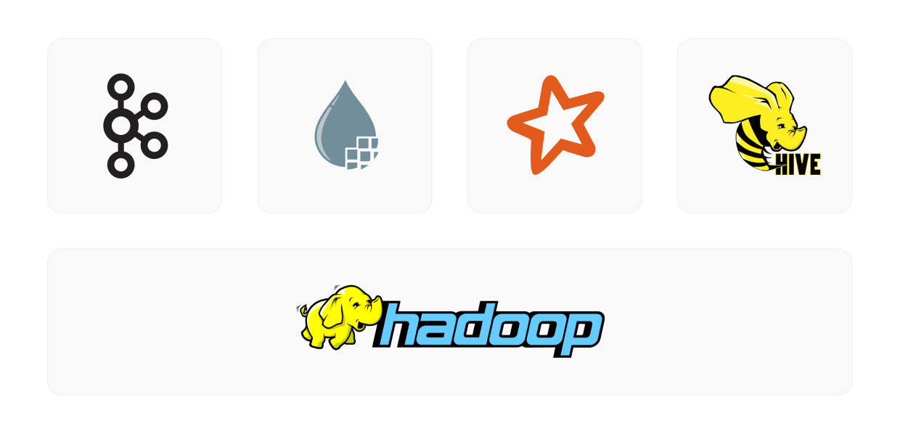

# Data Lake Premises

Projeto ponta a ponta de Big Data utilizando as principais ferramentas do ecossistema Hadoop/Apache, bancos de dados Oracle e MySQL e Linux (CentOS) com máquinas virtuais, fornecendo um ambiente completo de um Data Lake, desde como baixar até o seu funcionamento por completo.

Essa será a arquitetura a ser seguida no projeto:

* <b> O que é um Data Lake: </b> É uma arquitetura de armazenamento que tem como finalidade permitir que as empresas possam armazenar e processar grandes volumes de dados de diferentes fontes e formatos em um ambiente centralizado, escalável e flexível. Diferentemente dos sistemas de banco de dados tradicionais, um Data Lake não requer uma estruturação prévia dos dados, permitindo que os dados brutos sejam armazenados sem a necessidade de modelagem ou esquematização prévia.

* <b> Finalidade do Data Lake: </b>A finalidade do Data Lake é fornecer uma fonte única para todas as informações da empresa, permitindo que os usuários possam acessar, integrar e analisar dados de diferentes fontes em tempo real. Com um Data Lake, as empresas podem obter uma visão completa e abrangente de seus dados, permitindo que possam descobrir insights valiosos, identificar padrões e tendências, bem como criar modelos de análise e aprendizado de máquina mais precisos e eficazes.

## Tecnologias
[❒ VirtualBox](https://www.virtualbox.org/) • [CentOS](https://www.centos.org/) • [Java JDK](https://www.oracle.com/br/java/technologies/downloads/) • [Apache Hadoop](https://hadoop.apache.org/) • [Apache Kafka](https://kafka.apache.org/) • [Apache Nifi](https://nifi.apache.org/) • [Apache Spark](https://spark.apache.org/) • [Apache Hive](https://hive.apache.org/) • [MySQL](https://www.mysql.com/) • [Oracle Database](https://www.mysql.com/)

## Motivação
Este projeto experimental é o produto de minhas experiências com Data Lake, onde pude aprimorar minhas habilidades em arquitetura de dados, modelagem de dados, ingestão, processamento e análise de dados em grande escala. Através do uso de tecnologias modernas de armazenamento, pude explorar as diversas possibilidades de criação de um ambiente de Data Lake escalável e flexível.

## Sumário
+ [Preparando as máquinas](#Maquinas)
    + [Criação do Namenode](#Namenode)
    + [Criação do Datanode](#Datanode)
+ [Instalação do Linux (CentOS)](#CentOS)
    + [Instalação do CentOS no Namenode](#CentOSNamenode)
    + [Instalação do CentOS no Datanode](#CentOSDatanode)
+ [Configurações do sistema operacional](#Linux)
    + [Atualização](#Atualizacao)
    + [Arquivo sudoers](#Sudoers)
    + [Arquivo hosts](#Hosts)
    + [Arquivo sshd_config](#SSHD)
    + [SSH](#SSH)
+ [Instalação e configuração do Java JDK 8](#Java)
+ [Instalação e configuração do Apache Hadoop](#Hadoop)
    + [Configuração do Hadoop](#ConfiguracaoHadoop)
    + [Inicialização do Hadoop](#InicializacaoHadoop)
+ [Instalação e configuração do Apache Kafka](#Kafka)
+ [Instalação e configuração do Apache Nifi](#Nifi)
+ [Instalação e configuração do Apache Spark](#Spark)
    + [Configurando o Spark em Multinode Cluster](#Cluster)
+ [Instalação e configuração do Apache Hive](#Hive)
    + [Configuração do Metastore com Banco de Dados Oracle](#Oracle)
    + [Configuração do Metastore com Banco de Dados MySQL](#MySQL)
    + [Testando o Hive](#HiveTest)

## Requisitos para o projeto

> **Nota**: Este projeto foi concluído em dezembro de 2022, e é importante ressaltar que alguns dos requisitos abordados podem sofrer alterações ao longo do tempo. Como em qualquer área de tecnologia, novas soluções e tecnologias surgem constantemente, o que pode tornar algumas das abordagens e soluções apresentadas neste projeto desatualizadas em algum momento.

<b>Hardware:</b> Ao menos 8GB de memória RAM e 50GB de armazenamento interno.

<b>Sistema operacional:</b> Linux, Windows ou MacOS.

<b>Espaço em disco:</b> Ao menos 50GB de espaço em disco.

<b>Rede:</b> O Data Lake requer uma rede adequada para comunicação com outras máquinas e para acesso remoto.

## Tarefas
<b> Tarefas concluídas </b>

- [x] Descrever sobre a finalidade do Data Lake
- [x] Simular o ambiente On-Premises
- [x] Instalar os componentes do Data Lake
- [x] Verificar o funcionamento do Data Lake

<b> Futuras implementações </b>

- [ ] Automatizar os processos de instalação com bash script
- [ ] Acrescentar novas fontes de dados
- [ ] Acrescentar conexões com as novas fontes de dados

## Links 
* [Projeto no Site](https://alexandre-castro.vercel.app/blog/datalake-premises)

* [Projeto no Notion](https://alexandremcastro.notion.site/12-2022-Data-Lake-On-Premises-9845115c23374331a7a65c658fe3eeb1)

* [Projeto no GitLab](https://alexandremcastro.notion.site/12-2022-Data-Lake-On-Premises-9845115c23374331a7a65c658fe3eeb1)

* [Projeto no GitHub](https://alexandremcastro.notion.site/12-2022-Data-Lake-On-Premises-9845115c23374331a7a65c658fe3eeb1)

* [Download do Namenode](https://drive.google.com/file/d/1NrVKQ5mOb87hJMWtXDEWQa_Fg3f8GavX/view) 

* [Download do Datanode1](https://drive.google.com/file/d/1fn7T5Uj0oq8kOxIRWwCQBj7NLmxcerhl/view) 

* [Download do Datanode2](https://drive.google.com/file/d/1L7h5wPItRQrJplu9TPQphhLXLvJ7Fys3/view) 

## Conclusão
O objetivo final do Data Lake é ajudar as empresas a tomar decisões mais informadas e estratégicas, melhorando a eficiência dos negócios e aumentando a competitividade no mercado. Além disso, o Data Lake também pode ser usado para suportar outras iniciativas, como a conformidade regulatória, a governança de dados e a segurança da informação.